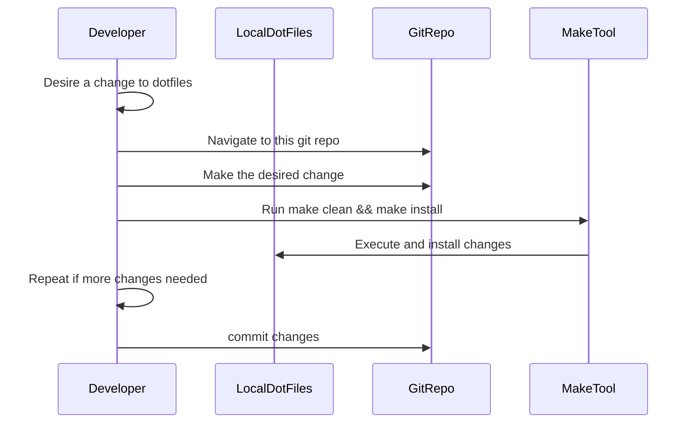

# dotfiles
My dev setup

# Get Started
`make clean`: Will backup then clear your current `.zshrc` and `.tmux.conf` files

`make install`: Will create `~/.zshrc` and `~/.tmux.conf` if it doesn't already exist and append the contents of these files from this repo. It will then source the changes.

# How it works
There's no linkage or automation to resolve or commit diffs between the files in this repo and the dotfiles in your `$HOME` directory.

